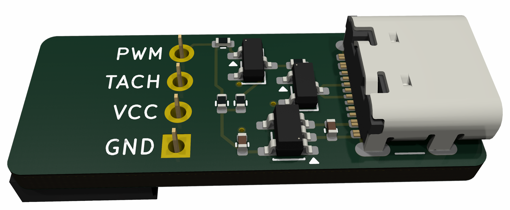

# AC Infinity Fan Adapter

This project is a small KiCad adapter board for controlling an AC Infinity Cloudline fan from a controller fan header that provides an open-drain PWM output.

The current design is aimed at controllers such as Antminer and Bitaxe boards. The adapter translates the controller-side PWM signal into the Cloudline UIS PWM input without exposing the controller PWM node to the fan's internal 10 V pull-up.

## Project files

- `acadapter.kicad_pro`: KiCad project file
- `acadapter.kicad_sch`: schematic
- `acadapter.kicad_pcb`: PCB layout
- `doc/acinfinity-usbc.md`: Cloudline connector pinout and interface notes
- `doc/render.png`: PCB render

## Design summary

The Cloudline fan uses a proprietary UIS connector on USB-C pins. Based on measurement so far:

- Cloudline PWM is pulled up internally to +10 V through about 10 kOhm
- direct connection to an unknown controller PWM output is not assumed safe
- the adapter uses the Cloudline +10 V rail to generate a local +5 V rail
- a two-transistor buffer recreates an open-drain PWM output for the fan side

The current design note and rationale are documented in `doc/acinfinity-usbc.md`.

## Status

This is an in-progress hardware project. The PCB and interface notes are in the repository, but the design assumptions should still be validated against real hardware before treating the board as production-ready.