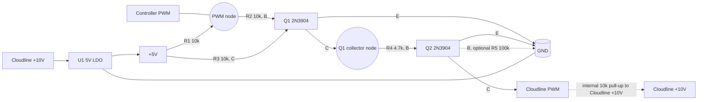

## AC Infinity Cloudline control

AC Infinity Cloudline fan controllers use the proprietary UIS (Universal Infinity System). It's a modified USB-C connector to connect the controller to the fan. There is no USB involved at all, AC Infinity just uses the USB-C connector for the fan signals.

## USB-C Connector pinout

| Fan Signal | Fan Wire Color | USB-C Pin | Description          |
| ---------- | -------------- | --------- | -------------------- |
| +10V       | Red            | VCC A4/B4 | 10V Power from fan   |
| GND        | Black          | GND A1/B1 | Ground               |
| PWM        | Yellow         | D+ A6/B6  | 0-10V PWM            |
| FG         | White          | D- A7/B7  | strange noise signal |

## Recommended PWM interface

Measured on one Cloudline fan: PWM to +10V is approximately 10k ohms.

Do not connect a controller PWM output directly to the Cloudline PWM pin unless you have verified that the controller fan-control transistor and any attached protection network are rated for at least 10 V in the off state.

If the Cloudline fan really has an internal pull-up to +10 V on PWM, then a direct connection means the controller PWM node will sit at about 10 V whenever its open-drain transistor is off. That is probably outside the safe range for a 3.3 V or 5 V fan-control circuit.

With a 10k pull-up to 10 V, the sink current is only about 1 mA when the PWM line is driven low:

$$
I = \frac{10\,\mathrm{V}}{10\,\mathrm{k\Omega}} \approx 1\,\mathrm{mA}
$$

So current is not the concern. Voltage stress on the controller side is the concern.

The safe approach is to buffer the controller PWM signal and recreate the open-drain output on the fan side.

### Preferred circuit

Use the Cloudline +10 V rail to generate a small local 5 V rail, then use two NPN transistors as a non-inverting open-drain buffer. This lets the adapter work with controllers such as Bitaxe that may not provide a 12 V rail on the fan header.

How it works:

- Controller PWM low: Q1 turns off, R3 pulls Q1 collector high, Q2 turns on, Cloudline PWM is pulled low.
- Controller PWM open: R1 pulls the controller PWM node to 5 V, Q1 turns on, Q1 collector goes low, Q2 turns off, Cloudline PWM is released and the fan's internal 10 V pull-up pulls it high.

This preserves the original PWM polarity while keeping the controller PWM node between 0 V and 5 V.

### Suggested parts

- U1: any small 5 V LDO that accepts at least 10 V input with margin, for example MCP1703A-5002, TLV76150, LM1117-5.0, or similar
- Q1, Q2: 2N3904, BC847, MMBT3904, or similar small NPN
- R1: 10k
- R2: 10k
- R3: 10k
- R4: 4.7k
- R5: 100k optional

The regulator only has to supply a very small current in this design, so LDO dissipation is low. If you later add anything more substantial to the adapter, recalculate power dissipation:

$$
P_{LDO} = (V_{IN} - V_{OUT}) \times I_{OUT}
$$

Changing the local pull-up rail from 3.3 V to 5 V does not require any other topology changes. The existing resistor values are still reasonable because the current levels remain low. Powering the adapter from Cloudline +10 V instead of the source board supply also does not require any topology change. The only practical changes are:

- use a 5 V regulator instead of a 3.3 V regulator
- update the pull-up rail labels from +3.3 V to +5 V
- feed that regulator from Cloudline +10 V rather than the source board power rail

If desired, R2 can be increased to 22k to reduce Q1 base current, but 10k is already acceptable.

Do not pull the controller PWM input all the way up to Cloudline +10 V. The regulator should create a local +5 V rail, and R1 should pull the controller PWM node up only to that +5 V rail.

### Why not direct-connect?

Direct connection is only reasonable if all of these are true:

- the controller PWM output is truly open-drain or open-collector
- the output transistor has at least a 10 V collector or drain rating, preferably 20 V or more for margin
- no MCU pin, clamp diode, or low-voltage protection device is tied directly to that node

Without the controller schematic or a confirmed transistor part number, assume direct connection is unsafe.

### FG line

The Cloudline FG pin does not appear to behave like a standard PC fan tach output. Leave it unconnected for now.